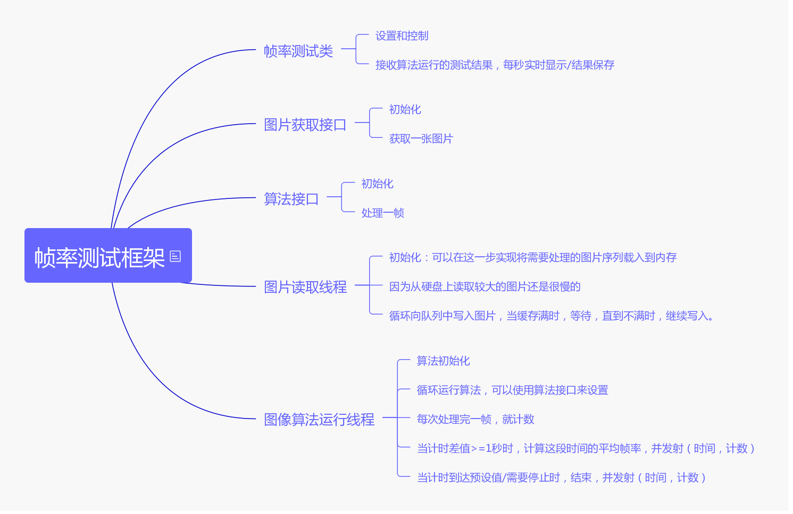

# 图像算法FPS测试框架

使用此框架提供的接口，只需要实现产生图片和图片算法这两个接口，以及简单的方法调用，就可以方便的测试图像算法的处理速度。

本项目依赖Qt5和OpenCV3.

如果有任何疑问或者建议，可以发Issues.

也欢迎加群讨论：728998570

## 功能

- 自定义图像的获取/生成方式。
- 自定义图像的处理算法。
- 图像的获取和算法处理分别在独立线程中，测试更精确。

## 用法

本项目依赖 `OpenCV3` 和 `Qt5` ，使用前请先确认开发环境符合要求。

- `./FPSTester` 文件夹中包含了本框架的所有源码。
- `./tests/simpleTest` 提供了一个简单的使用示例。

运行示例前，先在 `./tests/simpleTest/depends.pri` 文件中配置`OpenCV依赖路径`。

要在自己的工程中使用本框架非常简单，只需要将 `./FPSTester` 文件夹中的所有文件添加到你的工程中，然后分别实现 `FPSTester.h` 文件中的 `ImgGetter` 和 `Algorithm` 接口。最后，通过 `FPSTester` 类提供的方法，来配置并开始测试你的算法帧率。

## 贡献
欢迎Fork本项目，并提交自己的 Pull Request 来帮助改善这个项目。

